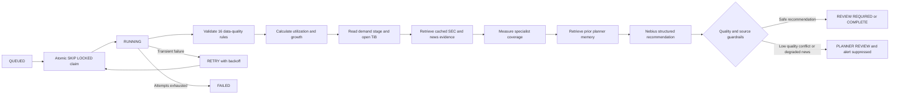
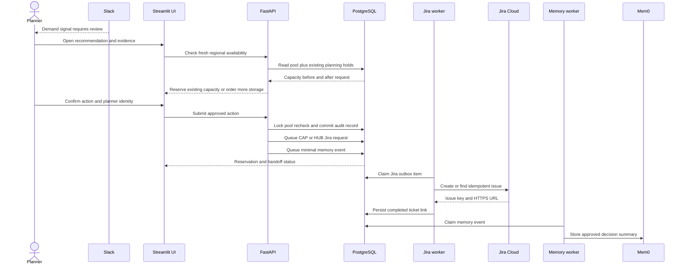

# CapacityPilot architecture

CapacityPilot is a bounded-autonomous capacity-planning system. Background workers gather
and score evidence without planner intervention; actions that reserve capacity, create Jira
work, or send an ad hoc Slack digest remain explicitly controlled and audited.

```mermaid
flowchart LR
    subgraph sources[Evidence and supply sources]
        history[Storage history and consumption]
        demand[Demand signals]
        sec[SEC EDGAR filings]
        publisher[Licensed news API optional]
        inventory[Regional capacity inventory]
    end

    subgraph foundation[PostgreSQL data foundation]
        company[(Company and region)]
        signals[(Capacity signals)]
        evidence[(News evidence)]
        supply[(Regional pools)]
        cases[(Case queue and audit events)]
        decisions[(Decisions and reservations)]
        outboxes[(Memory Jira and Slack outboxes)]
        outcomes[(Actual expansion outcomes)]
    end

    subgraph autonomous[Autonomous investigation runtime]
        api[FastAPI control plane]
        worker[Capacity worker]
        graph[LangGraph orchestrator]
        dq[Data Quality Agent]
        storage[Storage History Specialist]
        demandAgent[Demand Specialist]
        newsAgent[News Agent]
        evalAgent[Evaluation Agent]
        memoryAgent[Mem0 retrieval]
        llm[Nebius recommendation]

        api --> cases
        cases --> worker --> graph
        graph --> dq --> storage --> demandAgent --> newsAgent --> evalAgent --> memoryAgent --> llm
        llm --> cases
    end

    subgraph experience[Planner experience and governed actions]
        slack[Slack review alert]
        ui[Streamlit CapacityPilot]
        planner((Capacity planner))
        reserve[Reserve existing capacity]
        order[Order regional infrastructure]
        jiraCap[Jira CAP request]
        jiraHub[Jira HUB request]

        slack --> planner --> ui
        ui --> reserve
        ui --> order
        reserve --> jiraCap
        order --> jiraHub
    end

    subgraph delivery[Asynchronous delivery workers]
        newsWorker[News ingestion worker]
        memoryWorker[Memory worker]
        jiraWorker[Jira worker]
        slackWorker[Slack worker]
        mem0[Mem0 managed memory]
        jira[Jira Cloud]
        slackCloud[Slack]

        newsWorker --> evidence
        outboxes --> memoryWorker --> mem0
        outboxes --> jiraWorker --> jira
        outboxes --> slackWorker --> slackCloud
    end

    history --> signals
    demand --> signals
    sec --> newsWorker
    publisher --> newsWorker
    inventory --> supply
    company --> cases
    signals --> graph
    evidence --> newsAgent
    supply --> api
    api <--> ui
    reserve --> decisions
    order --> outboxes
    decisions --> outboxes
    slackCloud --> slack
    outcomes --> evalAgent
    planner --> outcomes
```

## Agent execution path



## Planner decision and handoff path



The detailed component responsibilities, state model, guardrails, benchmarks, deployment
model, and production-readiness plan are documented in the
[end-to-end design](end-to-end-design.md).
